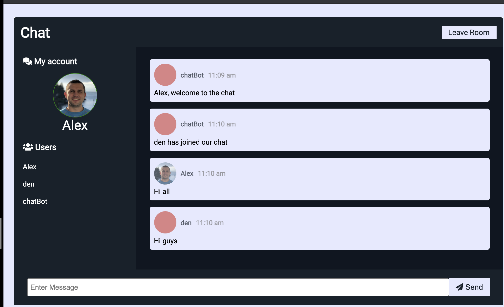

# Real Time chat with WebSockets and Vanilla JavaScript



This is my course project on a real-time chat application, which works using WebSockets technology and vanilla JavaScript

## Installation

To run the project, from server directory type:

```bash
npm i
npm start
```

## Technologies used in this project

WebSockets  
JavaScript  
Node JS  
Drag and Drop HTML5 API

## Functionality

1. After login we see a list of all users in the left navbar
2. All messages have the current time, username, and avatar icon
3. Each user receives a welcome message and message if other users joined or left the chat.
4. You can update the avatar image by drag and drop or by uploading the file after pressing on the current avatar image.
5. After updating the avatar all messages updates with a new avatar icon.
